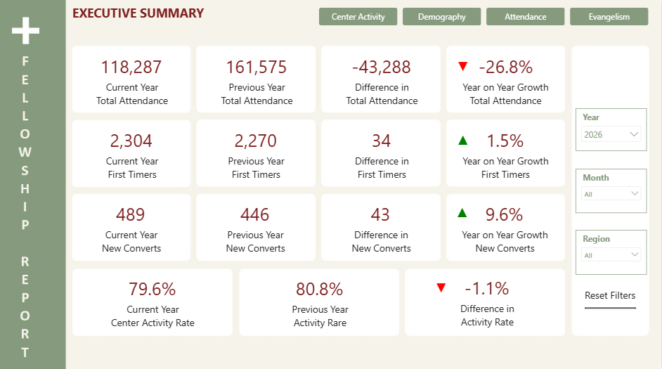
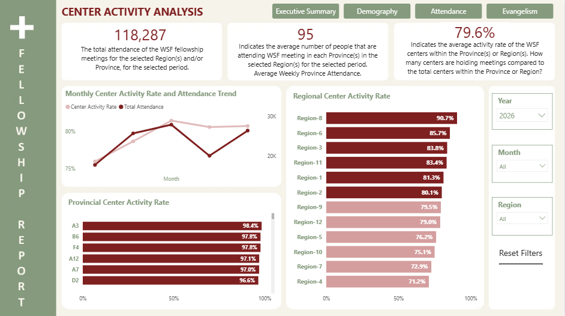
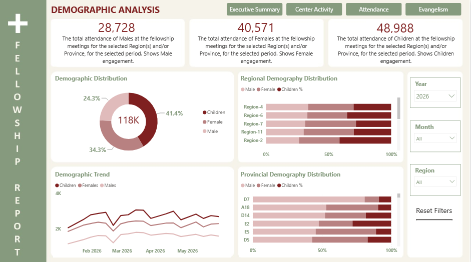
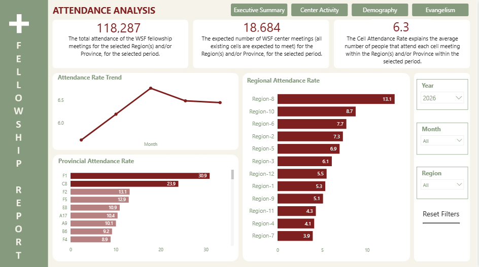
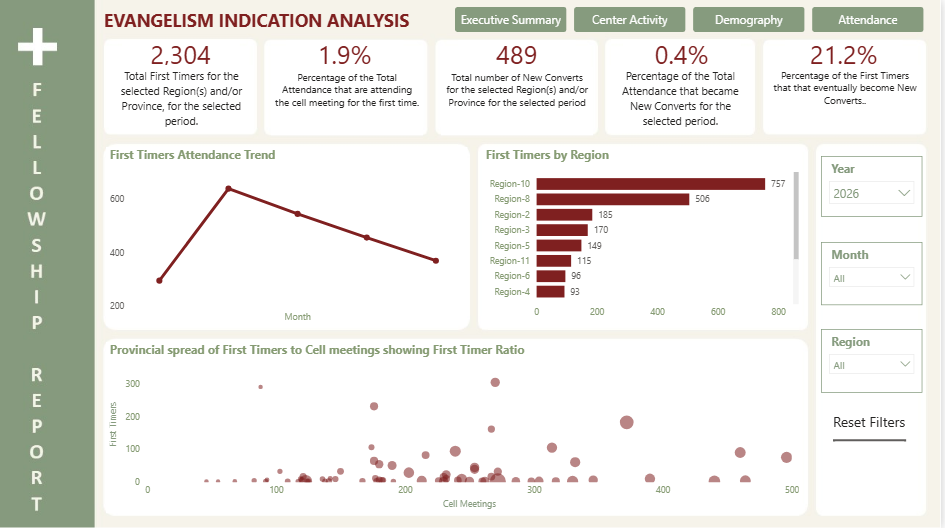

# **Fellowship Centers Attendance Dashboard**

## **Project Overview**
This project analyzes two years of weekly attendance data collected from over 1,000 fellowship centers distributed across multiple provinces and regions within a city. The objective was to transform operational and attendance records into actionable insights that support leadership decision-making, improve engagement, strengthen outreach efforts, and monitor church growth.
The solution was developed using Microsoft Power BI and provides an interactive reporting environment for analyzing attendance trends, center activity, demographic participation, and evangelism performance.

## **Live Dashboard**
An interactive version of this dashboard is available online:
[View Interactive Power BI Dashboard](https://app.powerbi.com/view?r=eyJrIjoiMjAyOWFiMjMtZjAzNi00ZTM0LTg4ODQtOWI5YjI1OTM1YmU0IiwidCI6ImIyYjlhYTc0LWVmMTctNGViOC04MDI2LTYwMDkzYzUzZjA5NyJ9)
#### **Power BI Dashboard:**
The dashboard allows users to:
- Explore attendance trends across multiple years
- Analyze center activity performance
- Review demographic participation patterns
- Evaluate evangelism and assimilation metrics
- Filter results by Year, Month, Region, and Province

## **Project Deliverables**
**Interactive Power BI Dashboard:**
[View Dashboard](https://app.powerbi.com/view?r=eyJrIjoiMjAyOWFiMjMtZjAzNi00ZTM0LTg4ODQtOWI5YjI1OTM1YmU0IiwidCI6ImIyYjlhYTc0LWVmMTctNGViOC04MDI2LTYwMDkzYzUzZjA5NyJ9)

**Executive Presentation:**
[Download PDF](presentation/Executive_Presentation.pdf)

**Project Case Study:**
[Download PDF](documentation/Project_Case_Study.pdf)

**Data Dictionary**
[Download PDF](documentation/Data_Dictionary.pdf)

**Dashboard Guide**
[Download PDF](documentation/Dashboard_Guide.pdf)

## **Business Questions**
This project was designed to answer the following questions:
#### **Growth and Engagement**
- Is attendance growing or declining over time?
- How does current performance compare with the previous year?
- Which regions and provinces contribute most to growth?
#### **Operational Effectiveness**
- What percentage of fellowship centers are actively holding meetings?
- Which areas have the highest and lowest center activity rates?
- How does center activity affect attendance performance?
#### **Demographic Participation**	
- What is the demographic composition of attendees?
- How do participation patterns vary across regions and provinces?
- Which demographic groups are growing fastest?
#### **Evangelism and Assimilation**
- Are fellowship centers attracting new people?
- How effective are regions at converting visitors into active participants?
- What opportunities exist to strengthen outreach and follow-up efforts?
## **Tools**
- Microsoft Excel
- Power Query
- Microsoft Power BI
- DAX
- Data Modeling
- Data Visualization

## **Dashboard Structure**
### **Dashboard 1 – Executive Summary**
Executive KPIs comparing current performance with previous-year performance.
#### **Key Metrics:**
- Total Attendance
- First Timers
- New Converts
- Center Activity Rate
- Year-over-Year Growth
### **Dashboard 2 – Center Activity Analysis**
Analysis of operational effectiveness and meeting execution.
#### **Key Metrics:**
- Total Attendance
- Average Weekly Province Attendance
- Center Activity Rate
#### **Visuals:**
- Monthly Center Activity Rate and Attendance Trend
- Provincial Center Activity Rate
- Regional Center Activity Rate
### **Dashboard 3 – Demographic Analysis**
Analysis of attendee composition and participation patterns.
#### **Key Metrics:**
- Male Attendance
- Female Attendance
- Children Attendance
#### **Visuals:**
- Demographic Distribution
- Regional Demographic Distribution
- Provincial Demographic Distribution
- Monthly Demographic Trends
### **Dashboard 4 – Attendance Analysis**
Evaluation of attendance effectiveness and participation trends.
#### **Key Metrics:**
- Total Attendance
- Total Expected Meetings
- Attendance Rate per Meeting
#### **Visuals:**
- Monthly Attendance Rate Trend
- Attendance Rate by Province
- Attendance Rate by Region
### **Dashboard 5 – Evangelism Indication Analysis**
Assessment of outreach effectiveness and visitor conversion.
#### **Key Metrics:**
- First Timers
- First Timers Ratio
- New Converts
- New Converts Ratio
- Converts-to-First Timers Ratio
#### **Visuals:**
- First Timers Trend
- First Timers by Region
- Outreach Performance Analysis

## **Key Insights**
- Attendance growth is strongly linked to center activity and meeting consistency.
- Significant performance variations exist across regions and provinces.
- Children attendees consistently represent the largest demographic segment.
- Visitor growth presents opportunities for stronger assimilation and follow-up processes.
- High-performing regions provide best practices that can be replicated across the network.

## **Dashboard Preview**

### Executive Summary

### Center Activity Analysis

### Demographic Analysis

### Attendance Analysis

### Evangelism Indication Analysis

## **Recommendations**
- Improve center activity rates in underperforming provinces.
- Strengthen visitor follow-up and assimilation processes.
- Replicate successful practices from high-performing regions.
- Increase data-driven monitoring and leadership reviews.
- Develop targeted engagement initiatives for specific demographic groups.

## **Data Privacy**
To protect organizational privacy, the original dataset is not included in this repository. Personal information and identifiable operational details were removed or anonymized before publication.

## **Portfolio Demonstrated Skills**
- Data Cleaning and Transformation
- Exploratory Data Analysis (EDA)
- Data Modeling
- DAX Measure Development
- Time Intelligence Analysis
- KPI Design
- Business Intelligence Reporting
- Dashboard Development
- Data Storytelling
- Executive Reporting

## **Author**
**Oladipupo A. T. OOGUNDE**
Data Analyst | Business Intelligence | Data Visualization | SQL | Power BI | Tableau | Python

**LinkeIn:** 
https://www.linkedin.com/in/tunde-ogunde-465a72173/